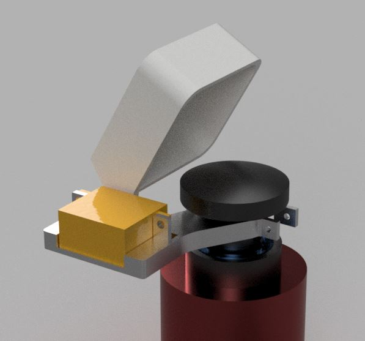

# KHO-BACC

The Boreal Auroral Camera Constellation (BACC) uses a small CCD colour camera and a fish-eye lens to capture videos of the night sky. The primary purpose is to record auroral activity during dark time.

There is a small "lens cap", or, shutter, to cover the lens during daytime. This shutter can be controlled by a computer: there is an Arduino Nano (etc.) and a small RC-servo that rotates the lens cap to either "open" or "close" the shutter.

For details and contact information, see [BACC All-Sky Color camera](https://kho.unis.no/Instruments/BACC.html)

